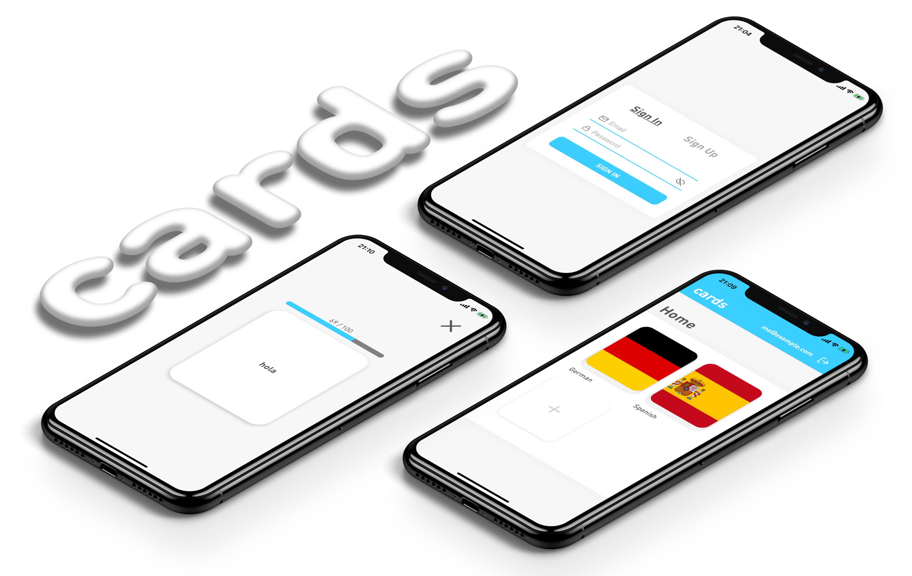

---
<div align="center">

### cards
An open-source clone of Duolingo's Tinycards ⚰️

<br>


<br>
</div>

---

## Features

- User accounts
- Confirmation emails
- Deck creation

## How to use
> :warning: Requires `Docker` and `docker-compose`

#### Clone the repository
```bash
git clone https://github.com/devicarus/cards.git && cd cards
```

#### Create a configuration
```bash
mv frontend/.env.example frontend/.env && vi frontend/.env
```

#### Run the containers
```bash
docker-compose up
```

> :rocket: Running on `localhost:80`